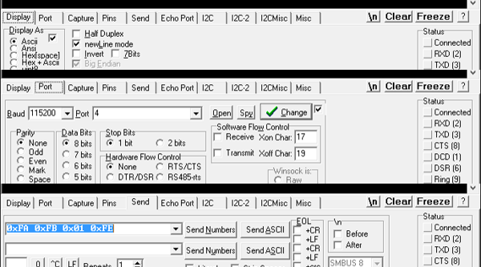
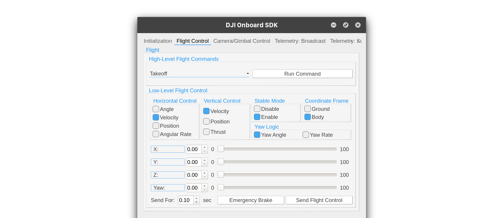

## Before you start

1. Make sure you have followed the steps in the [Hardware Setup guide](../development-workflow/hardware-setup.html) to get your connections right.
2. Follow the steps in the [Environment Setup guide](../development-workflow/environment-setup.html) to get your software platform ready to run samples. If you are working with M210 and want the *Advanced Sensing* features, please also follow the [M210 Onboard Computer Checklist](../M210-Docs/oes-checklist.html) to install extra dependencies.
3. Before you run the samples, consult the checklists in the [Running your Application](../development-workflow/run-application.html) guide.

## Linux Onboard Computer

##### Building the OSDK and Samples

1. Clone (or download as zip) the DJI OSDK from Github [here](https://www.github.com/dji-sdk/Onboard-SDK).
2. Open a terminal, `cd` into the onboardsdk folder and follow these steps to build the OSDK:

```
mkdir build
cd build
cmake ..
make
```

If you want the Advanced Sensing features for the M210, replace `cmake ..` with `cmake .. -DADVANCED_SENSING=ON` in the above commands. For Waypoint mission V2, please add `-DWAYPT2_CORE=ON`.

3. The above step builds the `osdk-core` library, as well as the Linux samples. Executables are located inside the `build/bin` folder.

##### Configuration
4. Still inside the `build` folder, copy the default user config file to your executable location:

```
cp ../sample/linux/common/UserConfig.txt bin/
```
5. Open the UserConfig.txt file in a text editor and fill in your App ID, Key, Baudrate and Port name in the designated places.

##### Running the Samples

6. Run your desired Linux sample (e.g. flight control sample) with the following command:

```
cd bin
./djiosdk-flightcontrol-sample UserConfig.txt
```
7. Follow the interactive prompt to execute actions available in the sample.

## ROS Onboard Computer

##### Installing the OSDK

1. Clone (or download as zip) the DJI OSDK from Github [here](https://www.github.com/dji-sdk/Onboard-SDK).
2. Open a terminal, `cd` into the onboardsdk folder and follow these steps to build the core OSDK library:

```
mkdir build
cd build
cmake ..
make djiosdk-core
```

If you want the Advanced Sensing features for the M210, replace `cmake ..` with `cmake .. -DADVANCED_SENSING=ON` in the above commands.

3. Now, install the osdk-core library to your system so that the `dji_sdk` ROS node may find it and link against it:

```
sudo make install djiosdk-core
```

##### Building the ROS Nodes

4. If you don't have a catkin workspace, create one as follows:

```
mkdir catkin_ws
cd catkin_ws
mkdir src
cd src
catkin_init_workspace
```
5. Clone (or download as zip) the DJI OSDK-ROS from Github [here](https://www.github.com/dji-sdk/Onboard-SDK-ROS) in the `src` folder.
6. Build the `dji_sdk` ROS package and the `dji_sdk_demo` ROS package.

```
cd ..
catkin_make
```

##### Configuration

7. Remember to source your `setup.bash`:

```
source devel/setup.bash
```
8. Edit the launch file and enter your App ID, Key, Baudrate and Port name in the designated places:

```
rosed dji_sdk sdk.launch
```

##### Running the Samples

9. Start up the `dji_sdk` ROS node:

```
roslaunch dji_sdk sdk.launch
```

10. Open up another terminal and `cd` to your catkin_ws location, and start up a sample (e.g. flight control sample):

```
source devel/setup.bash
rosrun dji_sdk_demo demo_flight_control
```
11. Follow the prompt on screen to choose an action for the drone to do.

## STM32 Onboard Computer

##### Installing and Setting up the OSDK

3. Clone (or download as zip) the DJI OSDK from Github [here](https://www.github.com/dji-sdk/Onboard-SDK).

4. Open the project located in `sample/STM32/OnBoardSDK_STM32/Project/OnBoardSDK_STM32.uvprojx` in Keil uVision IDE.

5. To build the code, developers need to input the correct APP KEY and APP ID obtained from DJI Developer site in `OnboardSDK_STM32/User/Activate.cpp` file.

##### Building and Running the Samples

6. To choose which sample to run, you need to pass a preprocessor flag using Keil. See the image to find the location (underlined in red) you need to edit:


7. Use the menu item `Project->Build Target` and `Flash->Download` to build the project and flash to the STM32 board.

8. Set the baud rate of your serial terminal software (here we use the open-source <a href="http://realterm.sourceforge.net" target="_blank"> RealTerm </a>) to be **115200**, which is the one we use to configure USART2 in the example App. Configure the serial terminal to display the received information in Ascii mode.


## QT

#### Project Setup

- In Qt Creator, click on the `Open Project` button, and navigate to the `sample/Qt/djiosdk-qt-sample/` directory. Select the `djiosdk-qt-sample.pro` file.
- In the Configure Project dialog box, select the appropriate compiler and Qt version and click `Configure Project`.
- Next, click on the `Projects` tab in the left-hand panel and select the `Run` settings under the `Build and Run` heading on the left.
- Check the `Run in Terminal` checkbox. On Linux, you might need to direct Qt Creator to the pre-installed `XTerm` terminal rather than gnome-terminal; go to `Tools->Options->System` and change the path in the `Terminal` box to `/usr/bin/xterm -e`.

Following these steps, your project should be set up correctly. You can choose to enter your App ID and Key in the `UserConfig.txt` file in the root of the folder to avoid entering it each time inside the application.

#### Running the Application

Click the `Run` or `Debug` button in the bottom left corner to start up the application.

The startup screen should look like this:


- First, select the serial port and hit the `Initialize Vehicle` button. This sets up the `Vehicle` object, initializes all components and reads App ID and Key from the UserConfig.txt file.
- Next, you must activate the drone and optionally obtain control.
- From here on, explore the various components by clikcing on the tabs at the top. For example, here is a screenshot of the Flight Control page:


- The terminal is your source of debug and status information; here is a screenshot of what that looks like.
 

If you are using `XTerm` on a HiDPI display, the fonts might be too small to read. In that case, hold down the Ctrl key and Right-click with a mouse on the XTerm window, and select `TrueType Fonts`.

