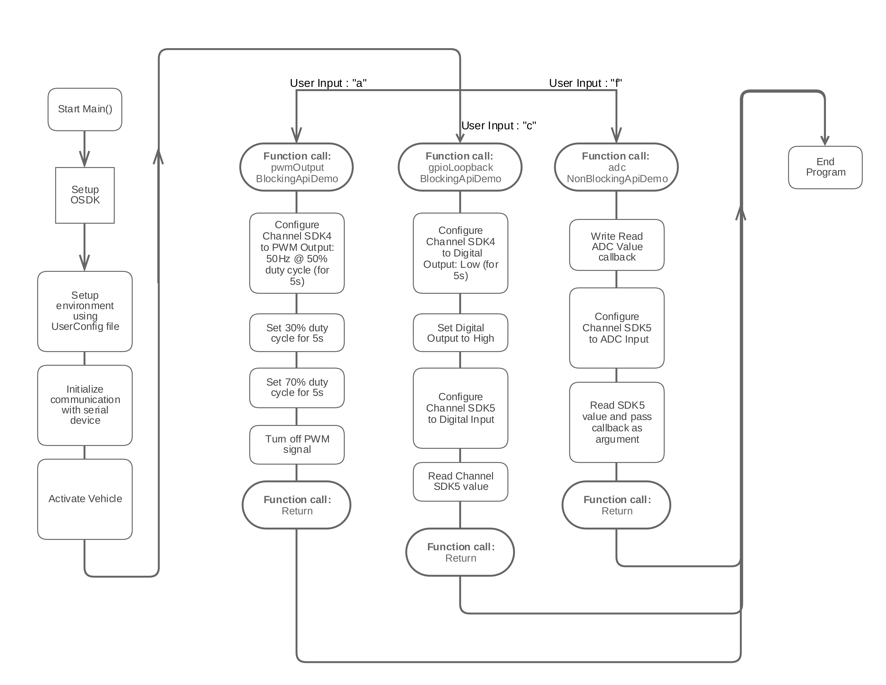
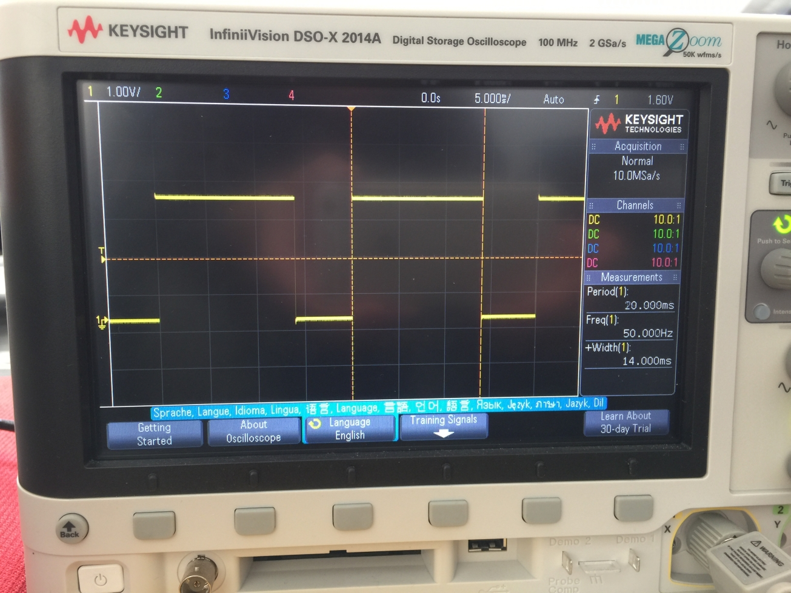
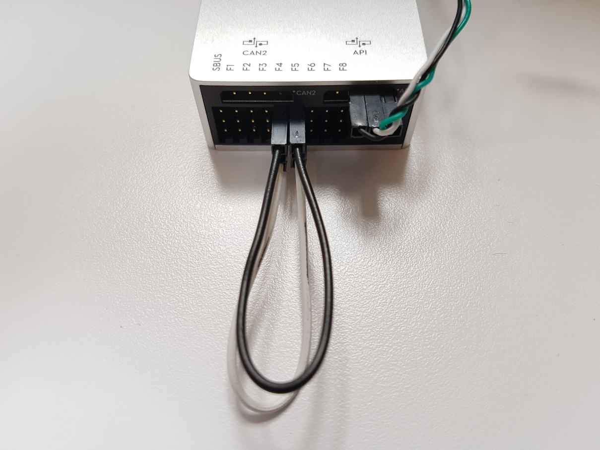

## Introduction

The Multi-Function I/O sample shows example usages of the function channels on the flight controller as various input/output channels.

## Goals

The MFIO sample is more varied than some of the other samples due to the nature of the functionality offered through the function channels. This sample intends to show configuration options for all the input and output modes. The MFIO sample is also intended to show the differences between the two different programming paradigms (blocking/non-blocking API) present within the OSDK.

1. PWM Output (Blocking API)- This example outputs a PWM signal at 50Hz on a pre-configured function channel, and sets three different duty cycles in succession. Connect an oscilloscope or a logic analyzer to view the output waveform.
2. PWM Output (Non-blocking API) - This example is essentially the same as the previous one, but executed through non-blocking API and callbacks; intended to show
3. GPIO Loopback (Blocking API)  - This example executes a loopback test - one pin is configured as output, and needs to be connected externally to another pin configured as an input. This sample shows both how to read and write digital signals.
4. GPIO Loopback (Non-blocking API) - Same functionality as the previous sample, but through non-blocking API.
5. ADC Input (Blocking API) - This example demonstrates how to read analog signals connected to a pre-configured external pin using the flight controller's internal Analog-Digital Converter.
6. ADC Input (Non-blocking API) - Same functionality as the the previous sample, but through non-blocking API.

## Code work flow

This flowchart shows a few of the options available in the prompt. Please read the source code to see the port configuration you need to do in DJI Asssitant 2; also note that you need to have an oscilloscope (or logic/waveform analyzer) and a function generator to try out all the samples present here.

## Setup & Output

#### PWM Output
Here is an example of the PWM output on an oscilloscope (70% duty cycle):

#### GPIO Loopback

**Setup:**

**Output:**

The output of the GPIO loopback (blocking) sample is shown on your terminal like this:

