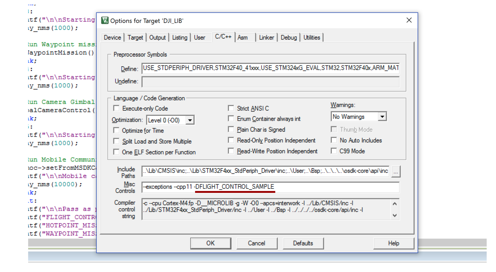

## Before you start

1. Make sure you have followed the steps in the [Hardware Setup guide](../development-workflow/hardware-setup.html) to get your connections right.
2. Follow the steps in the [Environment Setup guide](../development-workflow/environment-setup.html) to get your software platform ready to run samples. If you are working with M210 and want the *Advanced Sensing* features, please also follow the [M210 Onboard Computer Checklist](../M210-Docs/oes-checklist.html) to install extra dependencies.
3. Before you run the samples, consult the checklists in the [Running your Application](../development-workflow/run-application.html) guide.

## Linux Onboard Computer

##### Building the OSDK and Samples

1. Clone (or download as zip) the DJI OSDK from Github [here](https://www.github.com/dji-sdk/Onboard-SDK).
2. Open a terminal, `cd` into the onboardsdk folder and follow these steps to build the OSDK:
```
mkdir build
cd build
cmake ..
make
```
If you want the Advanced Sensing features for the M210, replace `cmake ..` with `cmake .. -DADVANCED_SENSING=ON` in the above commands.

3. The above step builds the `osdk-core` library, as well as the Linux samples. Executables are located inside the `build/bin` folder.

##### Configuration
4. Still inside the `build` folder, copy the default user config file to your executable location:
```
cp ../sample/linux/common/UserConfig.txt bin/
```
5. Open the UserConfig.txt file in a text editor and fill in your App ID, Key, Baudrate and Port name in the designated places.

##### Running the Samples
6. Run your desired Linux sample (e.g. flight control sample) with the following command:
```
cd bin
./djiosdk-flightcontrol-sample UserConfig.txt
```
7. Follow the interactive prompt to execute actions available in the sample.

## ROS Onboard Computer

##### Installing the OSDK

1. Clone (or download as zip) the DJI OSDK from Github [here](https://www.github.com/dji-sdk/Onboard-SDK).
2. Open a terminal, `cd` into the onboardsdk folder and follow these steps to build the core OSDK library:
```
mkdir build
cd build
cmake ..
make djiosdk-core
```
If you want the Advanced Sensing features for the M210, replace `cmake ..` with `cmake .. -DADVANCED_SENSING=ON` in the above commands.

3. Now, install the osdk-core library to your system so that the `dji_sdk` ROS node may find it and link against it:
```
sudo make install djiosdk-core
```

##### Building the ROS Nodes

4. If you don't have a catkin workspace, create one as follows:
```
mkdir catkin_ws
cd catkin_ws
mkdir src
cd src
catkin_init_workspace
```
5. Clone (or download as zip) the DJI OSDK-ROS from Github [here](https://www.github.com/dji-sdk/Onboard-SDK-ROS) in the `src` folder.
6. Build the `dji_sdk` ROS package and the `dji_sdk_demo` ROS package.
```
cd ..
catkin_make
```

##### Configuration
7. Remember to source your `setup.bash`:
```
source devel/setup.bash
```
8. Edit the launch file and enter your App ID, Key, Baudrate and Port name in the designated places:
```
rosed dji_sdk sdk.launch
```


##### Running the Samples

9. Start up the `dji_sdk` ROS node:
```
roslaunch dji_sdk sdk.launch
```
10. Open up another terminal and `cd` to your catkin_ws location, and start up a sample (e.g. flight control sample):
```
source devel/setup.bash
rosrun dji_sdk_demo demo_flight_control
```
11. Follow the prompt on screen to choose an action for the drone to do.

## STM32 Onboard Computer

##### Introduction

The system has the following setup:


The user can view the output of the program through the USART2 port of the STM32. The app communicates with the DJI product connected to the USART3 port through the Onboard SDK and prints feedback/debug information to the user thorugh USART2.

##### Toolchain
1. Download Keil MDK >5.22 and license it.
2. Use Keil's `Pack Installer` to install the latest STM32F4xx_DFP.2.x.x pack, as shown below. (Alternatively, you can download manually from <a href="http://www.keil.com/dd2/Pack/" target="_blank">http://www.keil.com/dd2/Pack/</a> and import the downloaded file from Pack Installer.)


##### Installing and Setting up the OSDK
3. Clone (or download as zip) the DJI OSDK from Github [here](https://www.github.com/dji-sdk/Onboard-SDK).
4. Open the project located in `sample/STM32/OnBoardSDK_STM32/Project/OnBoardSDK_STM32.uvprojx` in Keil uVision IDE.
5. To build the code, developers need to input the correct APP KEY and APP ID obtained from DJI Developer site in `OnboardSDK_STM32/User/Activate.cpp` file.

##### Building and Running the Samples

6. To choose which sample to run, you need to pass a preprocessor flag using Keil. See the image to find the location (underlined in red) you need to edit:

7. Use the menu item `Project->Build Target` and `Flash->Download` to build the project and flash to the STM32 board.
8. Set the baud rate of your serial terminal software (here we use the open-source <a href="http://realterm.sourceforge.net" target="_blank"> RealTerm </a>) to be **115200**, which is the one we use to configure USART2 in the example App. Configure the serial terminal to display the received information in Ascii mode.


## Understanding the Samples

The individual sample pages describe in detail the workings of the sample apps. Here are the available samples:

- [Telemetry Sample](telemetry.html)
- [Flight Control Sample](flight-control.html)
- [MFIO Sample](mfio.html)
- [Missions Sample](missions.html)
- [Mobile SDK Communication Sample](msdk-comm.html)
- [Camera/Gimbal Control Sample](camera-gimbal-control.html)
