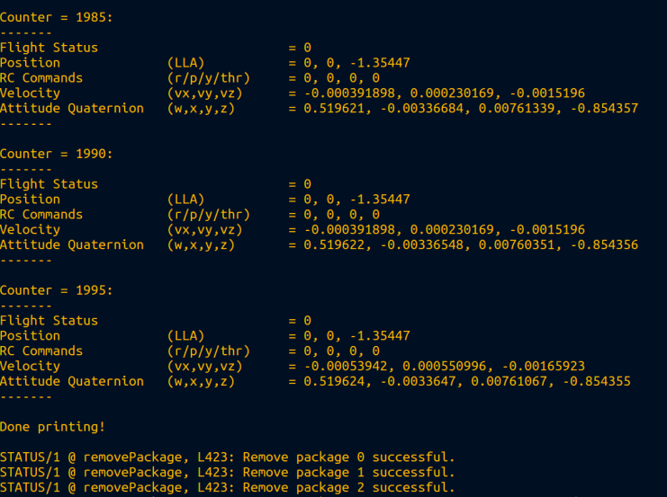

## 概述
为了提高应用程序在控制无人机执行飞行任务时的安全性，OSDK提供了数据广播和数据订阅功能，具有广播功能的应用程序能够实时向使用移动端APP（基于MSDK 开发）的用户、基于OSDK 开发的地面设备及其他设备发送无人机当前的飞行状态以及无人机上传感器产生的数据信息；具有消息订阅功能的应用程序，能够实时获取无人机上传感器产生的数据和无人机的飞行状态。

## 基础概念

### 消息订阅
无人机上的各个部件以及第三方传感器根据无人机实际的飞行状况，会实时产生大量的数据信息并被无人机推送给其他模块，具有消息订阅功能的应用程序，能够记录用户所需订阅的数据。
#### 订阅流程
#### 订阅项
使用OSDK 消息订阅功能可订阅的数据信息如 表1.无人机订阅项 所示。    
<div><div><p>
表1.无人机订阅项  </p></div>
<div>
<table>
  <thead>
      <th>数据类型</th>
      <th>订阅项（Topic）</th>
      <th>最大订阅频率（Hz）</th>
  </thead>
  <tbody>
  <tr>
      <th rowspan="4">无人机基础信息</th>
      <td>姿态四元数</td>
      <td>200</td>
    </tr>
    <tr>
      <td>硬件同步</td>
      <td>400</td>
    </tr>
    <tr>
      <td>返航点信息和设置状态</td>
      <td>50</td>
    </tr>
    <tr>
      <td>遥控器信息</td>
      <td>50</td>
    </tr>
    <tr>
      <th rowspan="7">无人机状态信息</th>
      <td>无人机飞行状态</td>
      <td>50</td>
    </tr>
    <tr>
      <td>无人机飞行模式</td>
      <td>50</td>
    </tr>
    <tr>
      <td>起落架状态</td>
      <td>50</td>
    </tr>
    <tr>
      <td>电调</td>
      <td>50</td>
    </tr>
    <tr>
      <td>电池</td>
      <td>50</td>
    </tr>
    <tr>
      <td>解锁电机错误码</td>
      <td>50</td>
    </tr>
    <tr>
      <td>飞行异常</td>
      <td>50</td>
    </tr>
    <tr>
    <th rowspan="6">无人机速度信息</th>
      <td>飞行速度</td>
      <td>200</td>
    </tr>
    <tr>
      <td>融合角速度</td>
      <td>200</td>
    </tr>
    <tr>
      <td>原始角速度</td>
      <td>400</td>
    </tr>
        <tr>
      <td>原始加速度</td>
      <td>400</td>
    </tr>
        <tr>
      <td>大地坐标系下的加速度</td>
      <td>200</td>
    </tr>
        <tr>
      <td>机体坐标系下的加速度</td>
      <td>200</td>
    </tr>
    <tr>
     <th rowspan="8">传感器信息</th>
    <tr>
      <td>气压计高度</td>
      <td>200</td>
    </tr>
        <tr>
      <td>融合气压计高度</td>
      <td>200</td>
    </tr>
            <tr>
      <td>返航点气压计高度</td>
      <td>1</td>
    </tr>
    <tr>
      <td>融合相对高度</td>
      <td>100</td>
    </tr>
    <tr>
      <td>指南针</td>
      <td>100</td>
    </tr>
    <tr>
      <td>VO视觉位置</td>
      <td>200</td>
    </tr>
      <tr>
      <td>避障信息</td>
      <td>100</td>
    </tr>
    <th rowspan="4">云台信息</th>
    <tr>
      <td>云台状态</td>
      <td>50</td>
    </tr>
        <tr>
      <td>云台角度</td>
      <td>200</td>
    </tr>
      <tr>
      <td>云台控制模式</td>
      <td>50</td>
    </tr>
        <th rowspan="6">定位信息</th>
    <tr>
      <td>GPS信号水平</td>
      <td>50</td>
    </tr>
        <tr>
      <td>GPS原始信息</td>
      <td>5</td>
    </tr>
      <tr>
      <td>GPS融合信息</td>
      <td>50</td>
    </tr>
          <tr>
      <td>RTK连接状态</td>
      <td>50</td>
    </tr>
          <tr>
      <td>RTK原始信息</td>
      <td>5</td>
    </tr>
  </tbody>
</table></div></div>

#### 订阅规则
* 消息订阅功能最多支持订阅0Hz、1Hz、10Hz、50Hz、100Hz，**5类频率**，每个订阅项只能被订阅一次。
* 指定订阅频率时，任何参数的订阅频率不能小于或等于0 ，相同订阅频率的主题的数据长度总和须小于或等于242。

### 广播
无人机上的各个部件以及第三方传感器根据无人机实际的飞行状况，会实时产生大量的数据信息，OSDK 的广播功能，不仅能够接收到无人机主动推送给其他模块的数据，还能够接收第三方传感器的数据，并通过广播功能广播所接收到的数据，基于MSDK 开发的移动端APP、基于OSDK 开发的地面设备、可接收无人机广播信息的设备或云端应用平台等可记录无人机广播的数据信息。

#### 广播项
具有OSDK 广播功能的应用程序可广播如下数据信息：
* 传感器数据信息：陀螺仪和磁力计等传感器读数
* 融合数据，例如态度和全球位置
* 无人机基础信息：电池，云台和飞行状态
#### 广播频率
* OSDK 的广播功能最多支持以0Hz、1Hz、10Hz、50Hz、100Hz，**5类频率**广播数据，每个广播项只能被广播一次。例如，如果将GPS指定为50Hz，将陀螺仪指定为10Hz，则来自广播的整个数据包将以50Hz传入，但是陀螺仪将仅每5个数据包中出现一次。
* 使用OSDK 的广播功能后，基于OSDK 开发的应用程序将以默认频率广播数据，如需更改广播频率，请调用广播功能中的API 或使用DJI Assistant 2 更改广播频率。
* 指定订阅频率时，任何参数的订阅频率不能小于或等于0 ，相同订阅频率的主题的数据长度总和须小于或等于242。

> **说明：** 由于广播功能占用的带宽较大且OSDK 将不再开发广播功能，建议使用消息订阅功能。

## 使用消息订阅功能
#### 1. 验证消息订阅功能
```c+
    ACK::ErrorCode subscribeStatus;
    subscribeStatus = vehicle->subscribe->verify(timeout);
    if (ACK::getError(subscribeStatus) != ACK::SUCCESS) {
      ACK::getErrorCodeMessage(subscribeStatus, __func__);
      return false;
    }
```

#### 2. 消息订阅功能初始化
指定订阅项、订阅频率、包编号、数据大小
```c+
    bool enableTimestamp = false;
    bool pkgStatus = vehicle->subscribe->initPackageFromTopicList(
        pkgIndex, topicSize, topicList, enableTimestamp, freq);
    if (!(pkgStatus)) {
      return pkgStatus;
    }
```
#### 3. 获取订阅数据
```c+
    subscribeStatus = vehicle->subscribe->startPackage(pkgIndex, timeout);
    if (ACK::getError(subscribeStatus) != ACK::SUCCESS) {
      ACK::getErrorCodeMessage(subscribeStatus, __func__);
```

#### 4. 清除订阅项
清除缓存区、停止订阅
```c
      ACK::ErrorCode ack = vehicle->subscribe->removePackage(pkgIndex, timeout);
      if (ACK::getError(ack)) {
        DERROR(
            "Error unsubscription; please restart the drone/FC to get "
            "back to a clean state");
      }
      return false;
    }
    return true;
  } else {
    DERROR("vehicle haven't been initialized", __func__);
    return false;
  }
```


您可以选择一组“主题”或“订阅”数据集，将它们添加到“订阅”包中，并配置该包以达到订阅频率。用户可以通过DJI Onboard API配置五个软件包。每个软件包可以设置为单独的频率，并具有300字节的固定大小的缓冲区，允许用户根据需要为每个软件包添加尽可能多的订阅项。

Output 
[](../../images/samples/telemetry_output.png)

