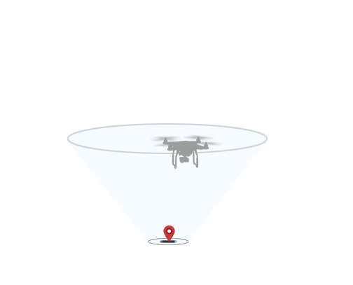

## Introduction

Missions can be used to easily automate flight. There are many different mission types that offer different product behavior. Some missions can be uploaded to and managed by the aircraft, while other missions are managed from the mobile device.

Missions run from the mobile device can offer more complex or customizable behavior, however if the wireless link between remote controller and aircraft is lost then they can be interrupted. In comparison, missions run from the aircraft will be less customizable and be limited by aircraft memory, but be able to continue when there is a loss in the wireless link.

## Waypoint Mission V1

A waypoint mission is a series of pre-defined locations (waypoints) the aircraft will fly to. A location is a latitude, longitude and altitude. Aircraft heading and altitude between waypoints can change either gradually or at the waypoint itself. A series of actions (such as take photo) can be executed at each waypoint.

During the mission, the mission can be manually adjusted using the remote controller control sticks. The mission speed can be sped up, slowed down or even executed in reverse. 

In v1, a waypoint mission is uploaded to and executed by the aircraft, but is limited by the amount of storage in the flight controller. Accordingly only 99 waypoints can be executed per mission. Custom Mission can be used to easily queue waypoint missions, in applications that require more than 99 points.

## Waypoint Mission V2 (beta)

In waypoint mission v2, an improved version of **Action** is added to bring more flexibility and functionality to your application.

Each action is comprised of an **Actuator** and a **Trigger**. 

The actuator supported in OSDK includes

- Camera
- Gimbal
- Aircraft Control

The trigger supported in OSDK includes

- Associate
- Simple Interval
- Simple Reach Point

Action works in parallel with the waypoint mission, users can mix and match triggers with actuators to execute certain behavior.
For example, user can move the gimbal while the aircraft reaches the second waypoint,
by simply uploading an action with a `Gimbal` actuator with parameters and a `Simple Reach Point` trigger at waypoint index 1.

In addition to this new feature, there are several improvements and bug fixes made:

- Provide more flexibility and configuration for each waypoint of a mission
- Support more waypoint transition types and yaw modes
- Provide configuration in case of RC connection lost
- Support yaw control action relative to current heading
- Support up to 65535 waypoints and 65535 actions per mission

## Hot Point Mission

In a Hot Point Mission, the aircraft will repeatedly fly circles of a constant radius around a specified point called a Hot Point (also known as Point of Interest). Altitude, velocity, the Hot Point location, aircraft heading and flight direction can all be defined as part of the mission.

Altitude, heading and radius can also be adjusted manually using the remote controller control sticks during the mission.

