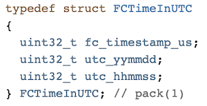

## Introduction

In M210 V2, a new feature, <a href="https://www.dji.com/matrice-200-series-v2" target="_blank">Time Synchronization</a>, 
is introduced, it offers developers the ability to accurately synchronize external sensing and compute with the GPS/RTK time, 
the flight controller clock, and the exposure time of the stereo cameras.

Time sync provides developers with a periodic pulse at the tail of the drone along with several software packets. 
These packets include FC and UTC time stamps, 
time-aligned IMU data and GPS/RTK NMEA messages.


## Why Time Sync?

The goal of time sync is to provide a common and low-drift time reference to accurately synchronize the captured time of the data
inside the drone with the clock of external sensors or compute.

An example use case - developers can accurately trigger the sensors onboard DJI aircraft 
and fuse them with the time-aligned data inside the drone such as IMU and images. 
All these data can be time-stamped on UTC time reference for inspection and documentary purposes.

## Differences between Time Sync and Hardware Sync
|                     | Time Sync   | Hardware Sync |
|---------------------|-------------|---------------|
| Supported Products | M210 V2 | A3, N3 |
| Time Reference | Free-flowing FC time + GPS/RTK time | Free-flowing FC time |
| Hardware Pulse Frequency | 1Hz for RTK, 5Hz for GPS | up to 400Hz |
| Time-aligned Data | IMU, Stereo images, NMEA messages| IMU|

## Principles of Operation

The central principal of operation for time sync can be followed in this diagram:


 1. When the drone is powered on, a 1Hz FC and UTC time stamp is pushed to the OSDK through UART regardless of the visibility of the GPS/RTK satellites
 2. before the GPS/RTK satellites are visible, the UTC time stamp will remain 0
 

 3. Whenever the GPS/RTK system is ready, a hardware pulse, 1Hz for RTK or 5Hz for GPS, will be available at the tail of the drone
 4. NMEA packets including GSA and RMC will output as push data at 5Hz along with the hardware pulses 
 5. To identify the exact UTC second of the hardware pulse, a 1Hz software packet with UTC time tag is pushed 
 approximately 500ms **before** the corresponding pulse, shown as red text in below figure
 6. The leading edge of the pulse corresponds to the beginning of the UTC second, rising from 0V to 3.3V
 
 7. The hardware pulse could come from three different GPS/RTK sources, this information is also available as push data.
 8. The FC time stamp from step 1 can be used to associate the time relationship between different components inside the drone
 9. The time stamp of stereo images, for example, is the exposure time in FC time reference (Please update to the latest FW in DJI Assistant 2)
 

 
## Onboard SDK Time Sync Implementation

To access these time-aligned data, two sets of APIs are provided, callbacks and message polling, 
for developers to subscribe to the data or to check the availability and obtain a copy of the data.
```
void subscribeNMEAMsgs(VehicleCallBack cb, void *userData);
void unsubscribeNMEAMsgs();
bool getNMEAMsg(NMEAType type, NMEAData &nmea);

void subscribeUTCTime(VehicleCallBack cb, void *userData);
void unsubscribeUTCTime();
bool getUTCTime(NMEAData &utc);

void subscribeFCTimeInUTCRef(VehicleCallBack cb, void *userData);
void unsubscribeFCTimeInUTCRef();
bool getFCTimeInUTCRef(DJI::OSDK::ACK::FCTimeInUTC &fcTimeInUTC);

void subscribePPSSource(VehicleCallBack cb, void *userData);
void unsubscribePPSSource();
bool getPPSSource(PPSSource &source);
```

Through these APIs, developers have two ways to access these data
 1. Developer provides a callback function, this function will be automatically called whenever new data is available
 2. Developer calls the getter function whenever needed, if new data is available, the getter function will return true and a copy of the data will be available
