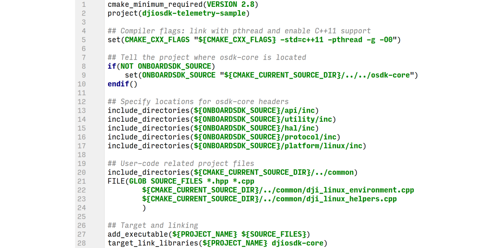

> **NOTE** This article is **Machine-Translated**. If you have any questions about this article, please send an <a href="mailto:dev@dji.com">E-mail </a>to DJI, we will correct it in time. DJI appreciates your support and attention.     

## Overview
OSDK provides lots of modules that developers could use, the specific architecture is as follows:
<div>
<div style="text-align: center"> <p> <span>
       </span> </p>
</div> </div>
      
## Integrate OSDK         
The application developed based on the OSDK use the `Vehicle` to call the interface or executed functions, so the developers need integrate the OSDK in their objects, as shown in Figure 1.      

* **Integrate OSDK Header Files**          
After integrate the OSDK header file into the program using the following statement.           
`#include <dji_vehicle.hpp>`
        
* **Integrate OSDK Help File**         
After integrated the OSDK help file in the program using the following statement, the application which developed based on the OSDK could read the user's configuration file and activate DJI's drone.           
`#include <dji_linux_helpers.hpp>`

<div>
<div style="text-align: center"> <p> Figure 1. Integrate OSDK </p>
</div>
<div style="text-align: center"> <p> <span>
       </span> </p>
</div> </div>

> **NOTE** L17 ～ 19 is written by the developer.

## Configure Dependencies
Using CMake:
1. The minimum version: version 2.8
2. The project name   
3. Configure compilation options (optional)
`set (CMAKE_CXX_FLAGS" $ {CMAKE_CXX_FLAGS} -std=C++11 -pthread -g -O0")`
4. The path containing the required header files
5. Generate and link executable files




## Call The Interfaces
OSDK provides developers with interfaces for synchronous and asynchronous:
* Synchronous      
When the developer *calls* the interface, the *interface* will obtain the corresponding return value according to the actual situation of the application. The *caller* needs to wait for the *called interface* to send the return value, so this calling method It also becomes a blocking call.
* Asynchronous      
When the developer calls the interface, the *interface* will get the corresponding return value according to the actual situation of the application, but the developer may not get the corresponding result immediately. When the *called interface* gets the result After that, the interface will inform the developer of the result through status or notification. The developer can process the result of the call through the callback function, so the calling method also becomes a non-blocking call.

#### Synchronous
When the developer *calls* the interface, the *interface* will obtain the corresponding return value according to the actual situation of the application. The *caller* needs to wait for the *called interface* to send the return value.     

Set the camera mode by the synchronous:

```c++
    ErrorCode::ErrorCodeType retCode;
    CameraManager *pm = vehicle->cameraManager;
   /*set camera work mode as SHOOT_PHOTO*/
    DSTATUS("set camera work mode as SHOOT_PHOTO");
    retCode == pm->setModeSync(index, camreamodule::WorkMode::SHOOT_PHOTO, 3);
    if (retCode != ErrorCode::SysCommonErr::Success){
        DERROR("Set camera as SHOOT_PHOTO fail. Error code : 0x%lX", retCode);
        ErrorCode::printErrorCodeMsg(retCode);
        return retCode;
    }
```

#### Asynchronous
Asynchronous interface call, when the developer *calls* the interface, the *interface* will get the corresponding return value according to the actual situation of the application, but the developer may not get the corresponding result immediately. When the *calling interface* gets the result , The interface will inform the developer of the result through status or notification, and the developer can process the result of the call through the callback function.
Set the camera mode by the asynchronous:

* Construct Callback Function
```c++
   /*set camera work mode as RECORD_VIDEO*/
    DSTATUS("set camera mode to RECORD_VIDEO");
    pm->setModeAsync(index, camreamodule::WorkMode::RECORD_VIDEO, 
                     setCameraModeForRecordVideoCb, &udata);

  void CameraManagerAsyncSample::setCameraModeForRecordVideoCb(
       ErrorCode ::ErrCodeType retCode, UserData userData){
       AsyncSampleData *uData = (AsyncSampleData *)userData;
       
       DSTATUS("retCode : 0x%lX", retCode);
    if (!uData) {
       DERROR("User data is a null value.");
    return;
  }
  if (retCode == ErrorCode::SysCommonErr::Success) {
    DSTATUS("set camera work mode successfully");
    if (uData->pm) {
        DSTATUS("start to RECORD_VIDEO");
        uData->pm->startRecordVideoAsync) {
        uData->index,
        (void(*)ErrprCode::ErrorCodeType, UserData))uData->userCallBack,
        uData-> userData);
        }
      } else {
        DERROR("start to record video error. Error code : 0x%lX", retCode);
        ErrorCode::printErrorCodeMsg(retCode);
      if (uData->userCallBack) {
      void (*cb)(ErrorCode::ErrorCodeType, UserData);
      cb = (void (*)(ErrorCode::ErrorCodeType, UserData))uData->userCallBack;
      cb(retCode, uData->userData);
    }
  }
}
```

* Register Callback Function     
After call the asynchronous interface in the OSDK, the corresponding data will be received, and the developer needs to register a callback function to handle the received data.   
Subscribe the data in the drone by registering the callback function:

```c++
void NMEA Callback(Vehicle* vehiclePtr, RecvContainer recvFrame, UserData userdata)
{
  int length =recvFrame.recvinfo.len-OpenProtocol::PackageMin-4;
  uint8_t rawBuf[length];
  memcpy(rawBuf, recvFrame.recvData.raw_ack_array, length);
  DSTATUS("&s/n",std string((char*)rawBuf, length).c_str())
}
```

## class Vehicle  
#### 1. `vehicle` Instantiation
When using OSDK to develop the application, the application need to read the environment configuration parameters, initialize the drone, and create an instance object `vehicle`.
     
1. Read the environment configuration parameters (Userconfig.txt)       
When compiling the sample code provided by OSDK, the application developed based on OSDK need to read environment configuration parameters such as third-party libraries, baud rate, and driver permissions.
```c++
  LinuxSetup linuxEnvironment (argc, argv);
```

2. Create an instance object `vehicle`      
Create an instance object `vehicle` and complete initialization.
```c++
  Vehicle *vehicle = linuxEnvironment.getVehicle(); 
  if (vehicle == NULL) {
    std::cout << "Vehicle not initialized, exiting. \n";
    return -1;
  }
  std::string sampleCase = linuxEnvironment.getEnvironment()->getSampleCase(); 
```

#### 2. Function Module Instantiation
After the `vehicle` is instantiated, the developer can instantiate the function module.
The following code takes the example of instantiating the camera module and initializing `PAYLOAD_INDEX_0` and` PAYLOAD_INDEX_1`.

```c++
ErrorCode::ErrorCodeType 
ret = vehicle->cameraManager->initCameraModule(PAYLOAD_INDEX_0,"Sample_camera_1");
  if (ret != ErrorCode::SysCommonErr::Success) {
    DERROR("Init Camera module Sample_camera_1 failed.");
    ErrorCode::printErrorCodeMsg(ret);
  }
ret = vehicle->cameraManager->initCameraModule(PAYLOAD_INDEX_1,"Sample_camera_2");
  if (ret != ErrorCode::SysCommonErr::Success) {
    DERROR("Init Camera module Sample_camera_2 failed.");
    ErrorCode::printErrorCodeMsg(ret);
  }
```
